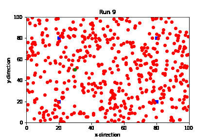
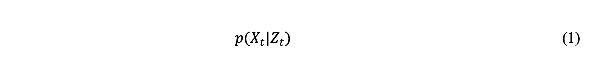
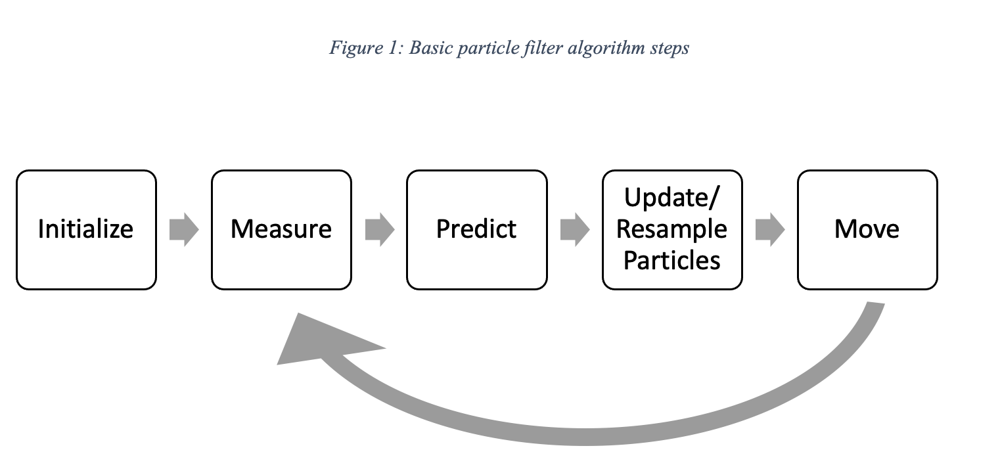
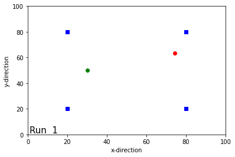
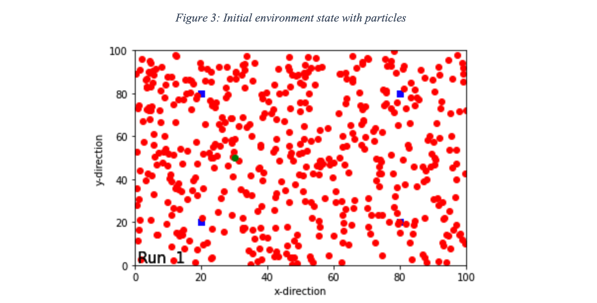
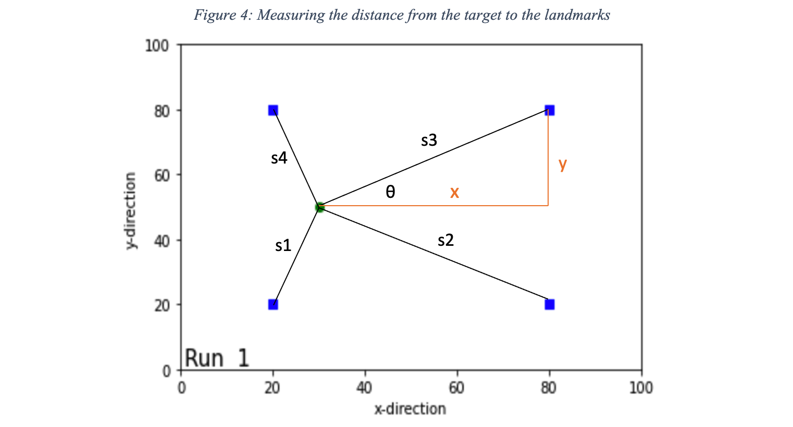
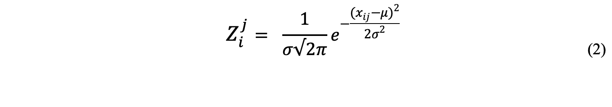
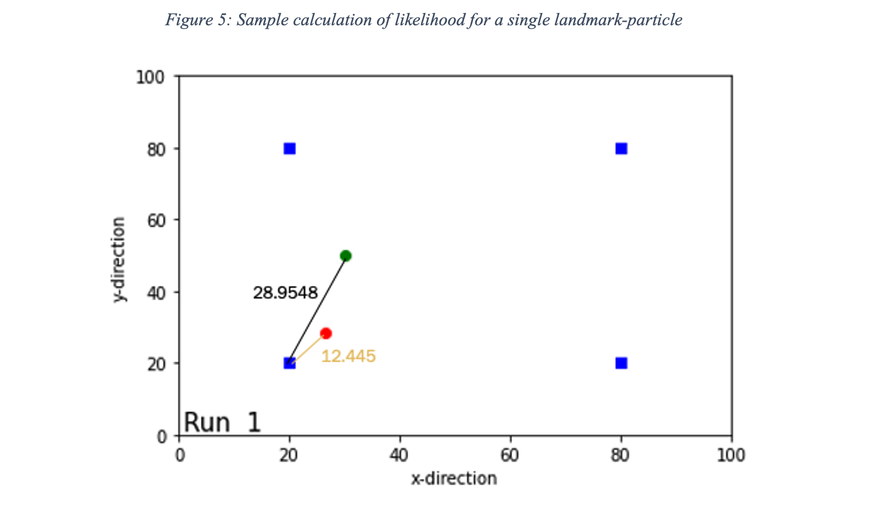
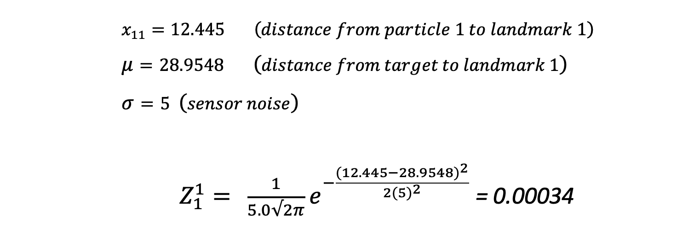
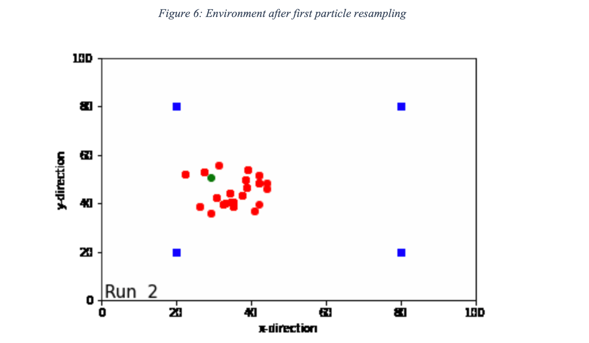

# _The Particle Filter – Explanation and Applications_

_By James O&#39;Connor_

_Applied Statistics &amp; Probability – MATH09004_

# Abstract

This paper discusses the workings the particle filter algorithm for tracking and localization applications on a basic level. The workings are demonstrated through a simulated example that was coded and visualized using Python. A review of the literature was undertaken and the advantages and disadvantages of the algorithm are discussed. Ultimately it was concluded that the particle filter continues to prove useful in a wide variety of use cases, and the advancement of new technologies such as advanced computing are alleviating the limitations of particle filtering to ensure it remains a useful tool for localization and tracking.

_Keywords – Particle Filter, Monte Carlo Localization, Autonomous Vehicles_

## Introduction

The autonomous vehicle (AV) industry has become one of the fastest growing technology industries with the aim of revolutionizing how we think about transport. Gartner predicts that by 2023 we will have 740,000 autonomous-ready vehicles worldwide [1]. One of the pressing challenges to the introduction of AVs is how to program them so that they can navigate safely through their local environment. In order to navigate through an environment, the vehicle has to estimate its own position within the environment at any point in time. This process is known as localization. Localization is the process of determining where a robot is located with respect to its environment [2]. In most cases, Global Navigation Satellite Systems (GNSS) are used for localization but in many cases these systems can become unavailable and can be inaccurate by over 10m [3].

The particle filter is an algorithm based on the idea that the data distribution is not known and &quot;particles&quot; are evaluated based on input from a measurement sensor and aggregated into more meaningful results [4]. In the context of robot localization, this algorithm can be used by a robot to localize and track itself in an environment, given that the map of the environment is known.

This paper examines the use of the particle filter for AV positioning through a simple simulation designed to represent a target vehicle navigating through a known map.

## Literature Review

The particle filter, also known as the bootstrap filter was introduced in 1993 [5]. It was introduced as an alternative to the Kalman filter which was the state-of-the-art at the time. It proposed a new way of generating the approximation of the state probability density function (PDF). Before the particle filter method, the PDF would be represented as a function, meaning it could only be used in the linear case. The method proposed by the particle filter algorithm represents this function as a set of random sample particles making it useful for non-Gaussian multi-modal pdfs. [6]explored the theory and practice of the particle filtering through the lens of positioning applications. This paper showed demonstrable benefits of the particle filter for underwater positioning, surface positioning, vehicle positioning and aircraft positioning. It also analyses the real-time performance drawing from a number of case studies where real-time tracking was achieved. Finally the paper highlights the issue of degrading particles as a key issue that persists with the algorithm that is still in the process of being solved. [7]examined the areas being researched around this algorithm today. The paper highlights parallel processing combined with GPUs as a key areas of research in recent years to help overcome the computational restraints of basic particle filtering.

The tracking problem we are trying to solve at its most fundamental is:

where represents the position of the target vector and represents the measurement estimates. In short, it is the probability of the target vector being where we estimate it to be given the estimate measurements. In the next section, a rudimentary 2D simulation model is created to demonstrate the basic workings of the algorithm and to investigate the issues outlined in the literature review.

## Worked Example

The basic structure of the algorithm is as follows:

### **Step 1 - Initialization**

This model environment is a 100m x 100m space with a target and four landmarks. The target is denoted by a green circle and it is the target we are trying to localise using the algorithm. The landmarks are assumed to be static and are denoted by blue squares. These landmarks are what the target will use to localise itself within the environment. The target represents some form of a robot that has the ability to move forward, rotate and measure the distance from itself to each landmark using a range-finding sensor.

The next step is to add the particles to the simulation. The particles represent a hypothesis of where the target is located or the distribution of likely states in the environment. The algorithm begins with a uniform distribution of points within the model environment. 500 particles were generated in this simulation as shown in Figure 3.

### **Step 2 - Measure**

The next step is to take the measurements from the target to each four landmarks as well as the measurements from each of the particles to each four landmark. In reality the distance from the target to the landmarks would be calculated using a range-finding sensor or a similar technology, however in the model, these distances can be calculated using the known and coordinates of the landmarks and the target. This measurement results in a set of measurements of length where is the number of landmarks being used for navigation.

### **Step 3 - Predict**

Using this set the probability density function of the particles can be calculated. Remember that the particles represent a hypothesis of where the target is located. These particle hypotheses create a probability density function centred around which is the mean value of the PDF. The normal distribution formula is used to calculate the probability for each particle (Equation 2). To use the normal distribution formula, the mean, standard deviation and variance are required. The mean, as stated is the actual measurement from the target to each landmark. The standard deviation is the measurement noise of the sensors, as a sensor measurement will always have a certain noise value and in most cases is not exact. The variance is the difference between the target-landmark measurement and the particle-landmark measurement.

In the above formula, represents the particle number and represents the landmark number. The likelihood for each particle is the product of all probabilities in . A sample calculation for a single particle and landmark below is outlined.

Repeating this calculation for landmarks (in this case four) generates four probability values which, multiplied together create the overall likelihood of the particle proximity to the target. Thus the probability for the first particle can be represented as follows.

This process is repeated for each particle in the algorithm. If the particles have similar measurements compared to the ; this reduces our variance value and subsequently increases the likelihood that the particle is close to the target. Each step requires the following number of calculations:

### **Step 4 – Update/ Resample**

Once the probabilities are known for each particle, the set of particles gets updated. There are a number of ways to resample the set of particles [8]however the general idea is to keep the high probability particles and disregard the low probability particles. In this simulation, the bootstrap filter was used to resample the set of particles.

Figure 6 demonstrates this resampling. It may appear that there are less particles than before however this is not the case. The particles that had a high likelihood were propagated within the set and the low likelihood particles were removed.

### **Step 5 – Move**

The next step involves the target taking a step in a specified direction. This allows for a new to be generated. In this model, as specified in the assumptions the robot can move forward and turn. The step and turn size of the target, two configuration parameters in the simulation, were set to 1m and 0.4 radians respectively. The noise of these step and turn measurements were also included in the simulation as a small Gaussian distribution around the step and turn values. The particles also move in the same direction and magnitude as the target.

## **Recursivity**

As the particle filter is a recursive Bayesian algorithm, this process from Step 2 to Step 5 gets recursively implemented and in theory the particles should converge on the actual location of the target and start tracking it. [Here is a link](https://github.com/jameseoconnor/particle-filter/blob/main/scatter.gif) to a demonstration of the algorithm recursing.

## **Advantages**

The particle filter is widely used for a number of reasons. One of the major reasons is that it works well for non-linear systems, a drawback of the other popular Bayesian filtering algorithm the Kalman filter. Secondly, it is highly generalizable and works with any motion and observation model that can be designed [9].

It is also relatively straightforward to implement. The full simulation was created with under 200 lines of code, including visualisations, making implementations easier to understand and maintain.

## **Disadvantages**

One of the major drawbacks of this algorithm is that a known map is required in order for it to be useful. If we do not know the precise location of the landmarks, we cannot use them as a reference measurement. New approaches such as Simultaneous Localization and Mapping (SLAM) work to overcome this issue by mapping the environment as the target navigates, however for pure particle filtering this is a limitation.

Another disadvantage is that it is not as scalable as other localization and tracking algorithms [10]. The amount of calculations required is the product of the number of particles and number of landmarks. This demonstration used 4 landmarks with 500 particles, meaning that for each recursive time update, 2000 calculations were required. This problem compounds with more landmarks and/or particles. Modern GPUs are being used to alleviate the computational burden with impressive results [11].

Finally, particle impoverishment is also an issue. Sample impoverishment occurs due to the reduction in the number of truly distinct sample values. This was visible through the demonstration in this paper, after ten iterations the distinct values in the particle sample set had degenerated to just 4 unique values from 500. Intelligent solutions exist to overcome this degradation however they tend to increase complexity and computational requirements [12].

## **Conclusion**

The particle filter is a widely used algorithm not limited to localisation and tracking problems. There are many variations of the particle filter, or more generally speaking Sequential Monte Carlo algorithms. This report has demonstrated the workings of the particle filter at a fundamental level. In the literature review, the issue of degradation of particle samples was highlighted, and this was re-established in the simulation carried out.

## Bibliography

[1] Gartner, &quot;Gartner Forecasts More Than 740,000 Autonomous-Ready Vehicles to Be Added to Global Market in 2023,&quot; November 2019. [Online]. Available: https://www.gartner.com/en/newsroom/press-releases/2019-11-14-gartner-forecasts-more-than-740000-autonomous-ready-vehicles-to-be-added-to-global-market-in-2023. [Accessed April 2021].

[2] S. Huang and G. Dissanayake, Robot Localization: An Introduction, Wiley, 2016.

[3]  G. World, &quot;GPS World,&quot; February 2015. [Online]. Available: https://www.gpsworld.com/accuracy-in-the-palm-of-your-hand/#:~:text=Under%20good%20multipath%20conditions%2C%202,GNSS%20receivers%20can%20be%20found.0. [Accessed April 2021]. 

[4]  ScienceDirect, &quot;Particle Filter,&quot; Science Direct, 2011. [Online]. Available: https://www.sciencedirect.com/topics/engineering/particle-filter. [Accessed May 2021]. 

[5]  D. S. A. S. a. G. D. N. Gordon, &quot;Novel approach to nonlinear/ non-Gaussian Bayesian state estimation,&quot; _IEEE Proceedings,_ vol. 140, no. 2, 1993. 

[6]  F. Gustafsson, &quot;Particle Filter Theory and Practice with Positioning Applications,&quot; _IEEE Access,_ 2015. 

[7]  S. Godsill, &quot;Particle Filtering: the First 25 Years and beyond,&quot; in _ICASSP 2019 - 2019 IEEE International Conference on Acoustics, Speech and Signal Processing (ICASSP)_, Brighton, 2019. 

[8]  R. Douc and O. Cappe, &quot;Comparison of Resampling Schemes for Particle Filtering,&quot; Ploytechnique, Paris, 2007. 

[9]  D. Bagnell, &quot;Good, Bad, and Ugly of Particle Filters,&quot; 2016. [Online]. Available: https://www.cs.cmu.edu/~16831-f14/notes/F14/16831\_lecture05\_gseyfarth\_zbatts.pdf. [Accessed May 2021]. 

[10]  R. K. F. G. Gustaf Hendeby, &quot;Particle Filtering: The Need for Speed,&quot; _EURASIP Journal on Advances in Signal Processing,_ 2010. 

[11]  C. M. Subhra Kanti Das and K. Banerjee, &quot;GPU accelerated novel particle filtering method,&quot; _Computing,_ 2014. 

[12]  T. L. T. Li, S. Sun and T. P. Sattar, &quot;Fight sample degeneracy and impoverishment in particle filters: A review of intelligent approaches,&quot; 2014. [Online]. Available: https://arxiv.org/pdf/1308.2443.pdf. [Accessed May 2021]. 